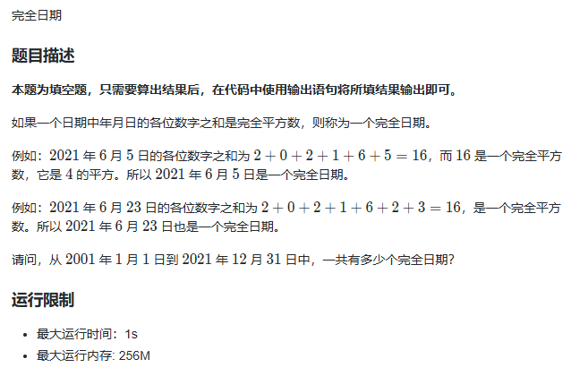

# 完全日期

## 怎么遍历 2001 年 1 月 1 日到 2021 年 12 月 31 日所有日期

1. 满足以下条件之一的年份是闰年：
    - 能被4整除但不能被100整除。
    - 能被400整除。

2. 本体给的范围只有被 4 整除的年份，简化了；

## 怎么快速判断每个日期各位数字之和为平方数

1. 先确定最大平方数范围，然后建表；
    - 最大值为 2019 09 29，2 + 0 + 1 + 9 + 9 + 2 + 9 = 32；（数位和最大时，后面几位都为9）
    - 建表到 36 即可；