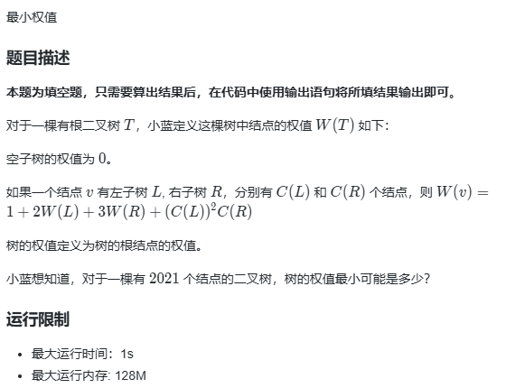

# 最小权值


## 动态规划（线性dp）

1. 确定 dp 数组含义：
    - dp[i] 节点数为 i 的二叉树中对应的表达式的最小值；
2. 确定递推公式：
    - dp[i] 由根节点和节点数之和为 i - 1 的左右子树组成；
    - 其中左右子树的节点数有 0 + (i - 1)，1 + (i - 2)，...，(i - 1) + 0 组合；
    - dp[i] 则取这些组合的二叉树对应的表达式的值的最小值；
    - 即：
        ```c++
        for (int j = 0; j <= i - 1; j++) { // 设左子树节点数为 j
            dp[i] = min(dp[i], 1 + 2 * dp[j] + 3 * dp[i - 1 - j] + j * j * (i - 1- j));
        }
        ```
3. 初始化 dp 数组：
    - dp[0] = 0；其余为 MAX，因为要求最小值；
4. 确定遍历顺序：
    - i 从小到大，j 随意；
5. 举例推导：略
