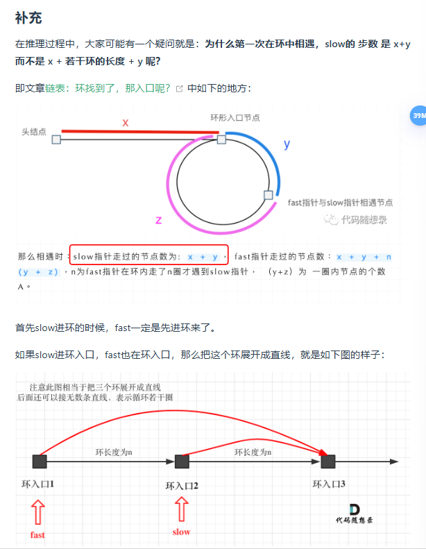
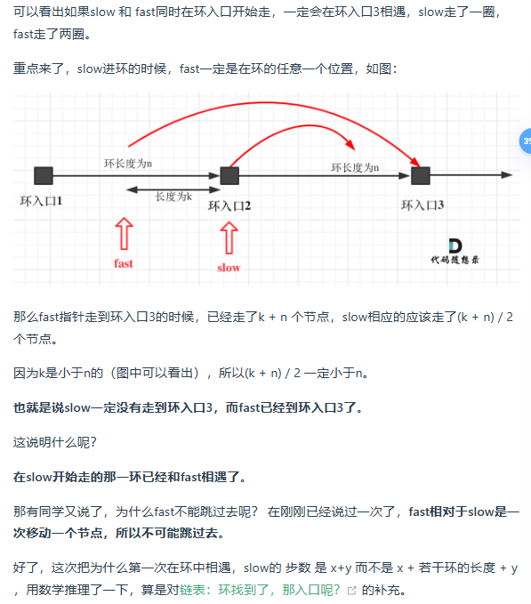

# 142.环形链表II

>题意： 给定一个链表，返回链表开始入环的第一个节点。 如果链表无环，则返回 null。
>
>为了表示给定链表中的环，使用整数 pos 来表示链表尾连接到链表中的位置（索引从 0 开始）。 如果 pos 是 -1，则在该链表中没有环。
>
>说明：不允许修改给定的链表。

## 思路
这道题目，不仅考察对链表的操作，而且还需要一些数学运算。

主要考察两知识点：

* 判断链表是否环
* 如果有环，如何找到这个环的入口

### 1.判断链表是否环

### 使用快慢指针，同时从链表头部出发，快指针每次移动两个节点，慢指针每次移动一个节点，若存在环，快指针进入环后会一直在环内转圈，当慢指针入环并和快指针相遇时，说明存在环。
#### 问：有没有可能即使存在环，快慢指针也可能不会相遇？
#### 答：若存在环，快慢指针一定会相遇，因为快慢指针入环后，他们的位置差在每次移动后都会增加或者减少1，且在相遇之前，位置差的变化是单调的，所以在一个环内快慢指针总会相遇。

### 2.如果有环，如何找到这个环的入口

### 假设头节点到入环节点距离x， 入环节点到相遇点距离y，剩下的环长度为z，快指针相遇时已经在环内转了n圈。
### 则快指针走了 x + y + n * (y + z)，慢指针走了 x + y （为什么慢指针没有走超过一圈？）
### 又因为快指针走的是慢指针的两倍，有 x + y + n * (y + z) = 2 * (x + y)
### x + y = n * (y + z)
### x = (n - 1) * (y + z) + z
### 因为 fast 指针一定是走完大于一圈才可能与 slow 相遇，所以 n >= 1，
#### 1. n = 1 时，x = z，这说明在 fast，slow 相遇时，从头节点出发一个指针，它会与 slow 指针相遇，此时相遇的节点便是入环节点。
#### 2. n > 1 时，slow 会多走（n - 1）圈，然后与新出发的指针相遇，同上。（为什么还是在入环节点相遇）

